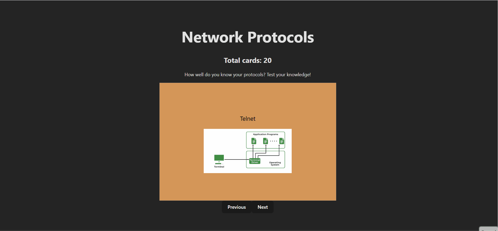

# Web Development Project 2 & 3 - Network Protocol Flashcards

Submitted by: Brianna Pinson

This web app was created as a study aid for many networking classes, providing descriptions of 20 (the number is dynamic and can be adjusted in an array) network protocols. When clicking the front of a card, it will reveal the definition of the protocol. Additionally, the color of each card is based on the primary layer of each protocol:
      1. Application is #db975a.
      2. Transport is #f6c597.
      3. Network is #c67972.
      4. Data Link is #ab534b.
      5. Physical is #647a8d.

Additionally, the user may guess the definition of the card and will recieve a response based on exact wording. The card list is ordered and there is no wrap-around navigation.

Time spent: 4 hours spent in total

## Required Features

The following **required** functionality is completed:

Part One
- [X] **The app displays the title of the card set, a short description, and the total number of cards**
  - [X] Title of card set is displayed 
  - [X] A short description of the card set is displayed 
  - [X] A list of card pairs is created
  - [X] The total number of cards in the set is displayed 
  - [X] Card set is represented as a list of card pairs (an array of dictionaries where each dictionary contains the question and answer is perfectly fine)
- [X] **A single card at a time is displayed**
  - [X] Only one half of the information pair is displayed at a time
- [X] **Clicking on the card flips the card over, showing the corresponding component of the information pair**
  - [X] Clicking on a card flips it over, showing the back with corresponding information 
  - [X] Clicking on a flipped card again flips it back, showing the front
- [X] **Clicking on the next button displays a random new card**

The following **optional** features are implemented:

- [X] Cards contain images in addition to or in place of text
  - [X] Some or all cards have images in place of or in addition to text
- [X] Cards have different visual styles such as color based on their category
  - Example categories you can use:
    - Difficulty: Easy/medium/hard
    - Subject: Biology/Chemistry/Physics/Earth science

Part Two
 [X] **The user can enter their guess into an input box *before* seeing the flipside of the card**
  - Application features a clearly labeled input box with a submit button where users can type in a guess
  - Clicking on the submit button with an **incorrect** answer shows visual feedback that it is wrong 
  -  Clicking on the submit button with a **correct** answer shows visual feedback that it is correct
- [X] **The user can navigate through an ordered list of cardss**
  - A forward/next button displayed on the card navigates to the next card in a set sequence when clicked
  - A previous/back button displayed on the card returns to the previous card in the set sequence when clicked
  - Both the next and back buttons should have some visual indication that the user is at the beginning or end of the list (for example, graying out and no longer being available to click), not allowing for wrap-around navigation

## Video Walkthrough

Here's a walkthrough of implemented required features:

GIF created with [ScreenToGif](https://www.screentogif.com/) for Windows.

## Notes

This project was not too hard, similar to the previous assignment. It was interesting to learn about the states and put them into practice.

## License

    Copyright [2026] [Brianna Pinson]

    Licensed under the Apache License, Version 2.0 (the "License");
    you may not use this file except in compliance with the License.
    You may obtain a copy of the License at

        http://www.apache.org/licenses/LICENSE-2.0

    Unless required by applicable law or agreed to in writing, software
    distributed under the License is distributed on an "AS IS" BASIS,
    WITHOUT WARRANTIES OR CONDITIONS OF ANY KIND, either express or implied.
    See the License for the specific language governing permissions and
    limitations under the License.eslint`](https://typescript-eslint.io) in your project.
